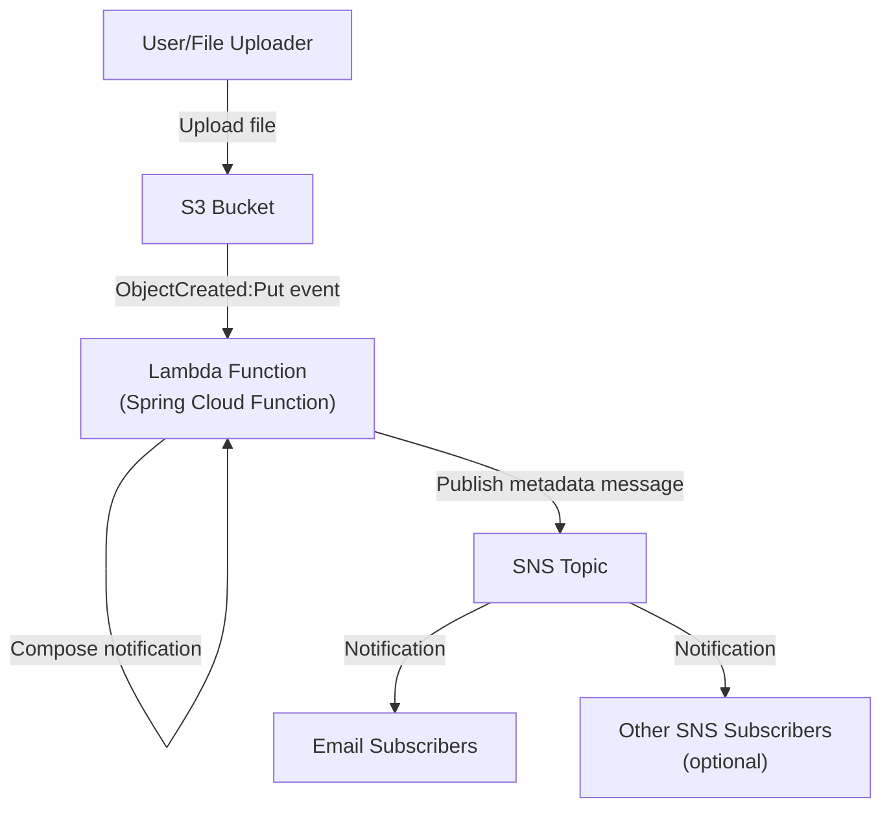

# Meta-Ping Architecture

## System Overview

This document describes the architecture of the Meta-Ping file notification system.

## Component Details

### S3 Bucket
- Purpose: Stores uploaded files

### Lambda Function
- Implementation: Spring Cloud Function
- Trigger: S3 ObjectCreated:Put event
- Function: Extracts metadata and publishes to SNS
  - File name (from S3 event key)
  - File size (can get from S3 metadata or event)
  - File type (MIME type from S3 metadata or inferred)

### SNS Topic
- Purpose: Distributes file upload notifications
- Subscribers: Email and other optional subscribers
- Message format: [Define your message structure]

## Data Flow

1. User uploads file to S3 bucket
2. S3 event triggers Lambda function
3. Lambda extracts metadata and composes notification
4. Lambda publishes message to SNS topic
5. SNS delivers notifications to all subscribers
