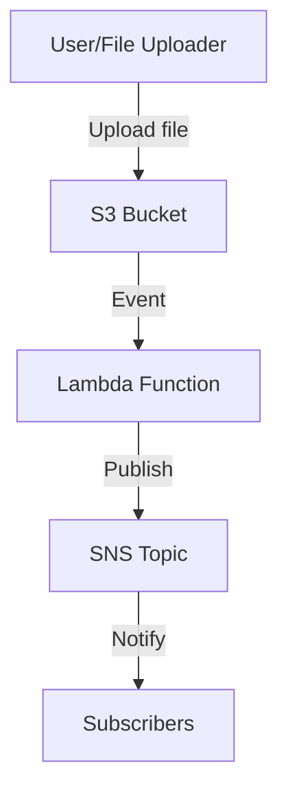

# Meta-Ping

A serverless application for file processing, metadata extraction and SNS notification using AWS S3, Lambda, and SNS.

## Tech Stack

### Core Frameworks & Languages
- Java
- Spring Boot
- **Spring Cloud Function**: Abstracts the business logic to be portable across cloud providers (AWS Lambda).
- Maven
- LocalStack
- Testcontainers
### Cloud Services (AWS)
- AWS Lambda
- AWS S3
- AWS SNS
- **AWS SDK for Java**: Used for programmatic interaction with AWS services.
### Quality & Security (CI/CD)
- **GitHub Actions**: Automates the build, test, and deployment pipelines.
- **SonarCloud**: Static analysis for code quality, bugs, and technical debt.
- **JaCoCo**: Generates code coverage reports for SonarCloud.
- **GitLeaks**: Detects hardcoded secrets and credentials in the codebase.

## Architecture Overview
Meta-Ping uses a serverless event-driven architecture:

1. Files are uploaded to an S3 bucket
2. S3 events trigger a Lambda function (Spring Cloud Function)
3. The Lambda extracts metadata and publishes to SNS
4. SNS delivers notifications to subscribers

For detailed architecture information, see [ARCHITECTURE.md](ARCHITECTURE.md).

### Optional Enhancements:
- API Gateway endpoint for manual file processing or status checks.
- Lambda writes metadata + processing logs into S3 (or DynamoDB).

### Notifications toggle

Notifications are optional. The `MetaNotifier` bean is only created when `notifications.enabled=true` (or `NOTIFICATIONS_ENABLED=true` in the environment). This allows running the function without SNS configured (e.g., local dev/CI) while still processing S3 events normally. When disabled, notification publishing is skipped.

## Local testing with LocalStack

This project includes integration tests that use LocalStack (via Testcontainers) to validate the S3 → Lambda (function) → SNS → SQS flow.

What gets verified:
- An S3 event triggers the function, the function extracts file metadata, and a notification is published to SNS.
- The SNS message is delivered to an SQS subscription, and the test asserts the message content.
- A negative‑path test confirms that when notifications are disabled, no message is published, while the function still returns metadata.

Notes:
- If Docker is not available, the LocalStack tests are skipped automatically.
- The tests dynamically wire the application properties to point the SDK to LocalStack.

Troubleshooting:
- Ensure Docker is running and enough memory/CPU is allocated to it.
- If tests are flaky in slow environments, increase polling timeouts; see the constants in `MetaPingApplicationTests`.
- Port conflicts or firewall/proxy issues can interfere with Testcontainers; check Docker logs if the LocalStack container fails to start.
