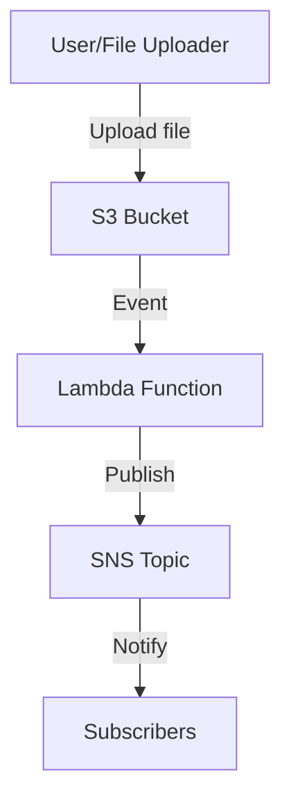

# Meta-Ping

A serverless application for file processing, metadata extraction and SNS notification using AWS S3, Lambda, and SNS.

## Architecture Overview

Meta-Ping uses a serverless event-driven architecture:

1. Files are uploaded to an S3 bucket
2. S3 events trigger a Lambda function (Spring Cloud Function)
3. The Lambda extracts metadata and publishes to SNS
4. SNS delivers notifications to subscribers

For detailed architecture information, see [ARCHITECTURE.md](ARCHITECTURE.md).


### Optional Enhancements:
- API Gateway endpoint for manual file processing or status checks.
- Lambda writes metadata + processing logs into S3 (or DynamoDB).


## Current Implementation

The current version implements a simple string reversal function using Spring Cloud Function.

## How to Use String Reversal Function

Send a POST request to `/reverseString` with a text payload to reverse a string:

```bash
curl -X POST http://localhost:8080/reverseString -H "Content-Type: text/plain" -d "Hello, World!"
```

Response:
```
!dlroW ,olleH
```
